**Extending vRealize Operations with vRealize Orchestrator**

Sometimes it's a good thing to connect vRealize Orchestrator to vRealize Operations to be able to do actions and remedies based on alerts in vRealize Operations. Another thing that this connection provides is the possibilities to run Orchestrator workflows directly from vRealize Operations objects. 

### How we do this - in details, now!

**Prerequisites**

You will need:

1. **vRealize Orchestrator** installed
   This can either be included together with vRealize Automation, or, a standalone Orchestrator solution. My Orchestrator is installed with vRealize Automation. I'll use that! If you do not have it, download your standalone version from [Customer Connect](https://customerconnect.vmware.com/) (vRO is free with vCenter). Look under "Download VMware vSphere"
2. **vRealize Operations** installed. Well I have already used vRealize Lifecycle Manager and deployed mine. It is connected to vCenter,  to vRealize Log Insight, and to vRealize Automation. This helps with both a Last mile of troubleshooting as well as providing my deployments in vRealize automation with metrics from vRealize Operations, for example Cost / Price, Showback / Chargeback information
3. **Download** the vRealize Operations management pack from the marketplace. Basically, just go to the marketplace and search for "VMware vRealize Operations Management Pack for vRealize Orchestrator". Since I will be showing this for vRealize Operations 8.6.x we need version 3.2 of the Management Pack for vRealize Orchestrator: https://marketplace.cloud.vmware.com/services/details/management-pack-for-vrealize-orchestrator11?slug=true
4. The file name would for example be: *"vmware-mpforvro-3-1634214904032.pak"* 

## Add the management pack into vRealize operations

1. Open vROps, log in, and go to Data Sources>Repository, and Click "Add"
2. Browse for the management pack and select Reset default content and make sure you overwrite a potential older management pack:  
3. When the thing is finished installing, go to Integrations, Accounts, and add a new account using the vRealize Orchestrator adapter, Fill in the Orchestrator FQDN, Port (443), and click the '+' to add your credentials
   

Add your credentials and click OK. I've used my 'configadmin' user for vRA that will access everything.
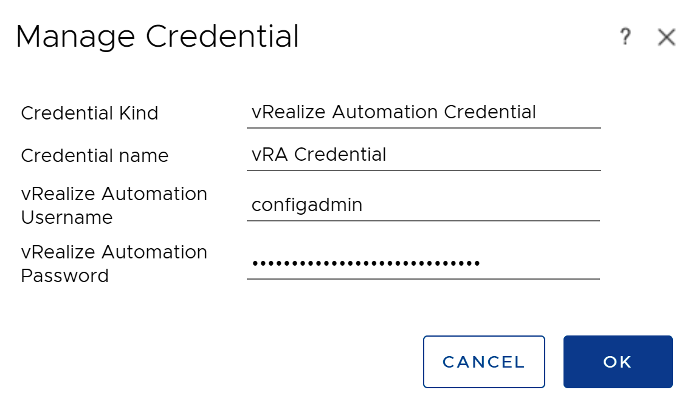

Click validate connection and then cick OK after validation. 
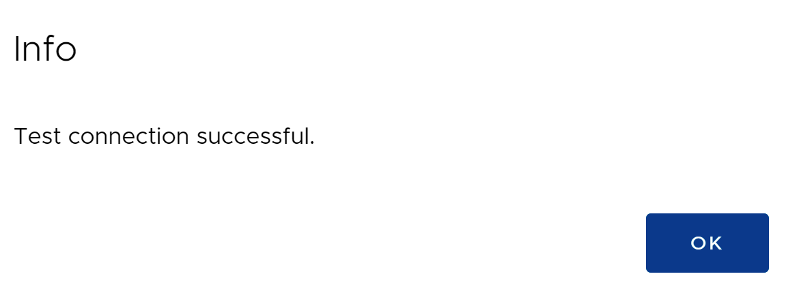

**Fetch the workflows**

Right, So now the Management Pack is installed, and Configured. Now we need to see if vRealize Operations is fetching the wokflows from vRealize Orchestrator

1. Wait a collection cycle - get a coffee

2. **Environment** > **Object browser**. click your connector and drop down the actions menu, then select **Import** vROps package to vRO, choose overwrite, **Begin Action**, make sure the recent tasks shows *Complete*: 
   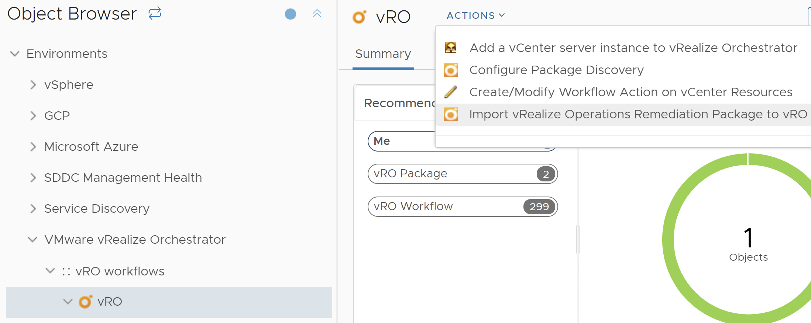
   
3. Under Object browser, in the actions menu choose **Configure Package Discovery**, Choose **Begin Action** 
   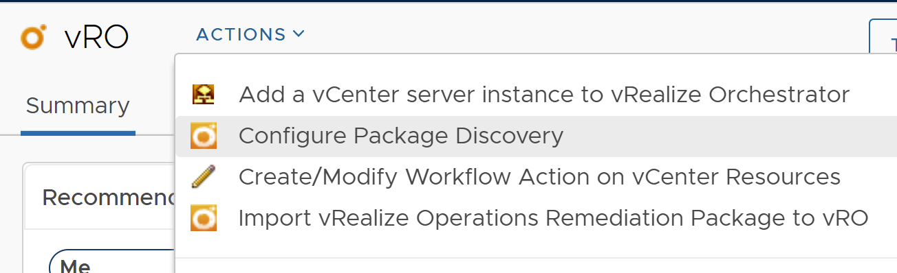
   
4. Continue the process to **Add a vCenter to vRO.** and Begin Action
   
   
5. Select your vCenter, Fill in user name (ie. administrator@vsphere.local or some fantastic power user), password, and domain (typically *vsphere.local*) 
   
   WARNING: Before click 'Begin Action' make sure you have <u>removed</u> the checkbox for "Session per User"
   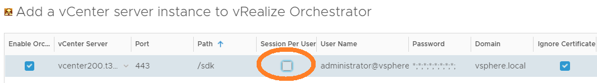
   
6. Warning:   If you understood what checkbox you shoudl uncheck, just Click **Begin Action**

## Verify workflows

The last check is to see if vRealize Operations has discovered all the Workflows. 

1. Click **Environment** > **Inventory**, and select **Adapter Types**, and then the **vRealize Orchestrator adapter**. 
2. We should now see the objects list populated with all the workflows:

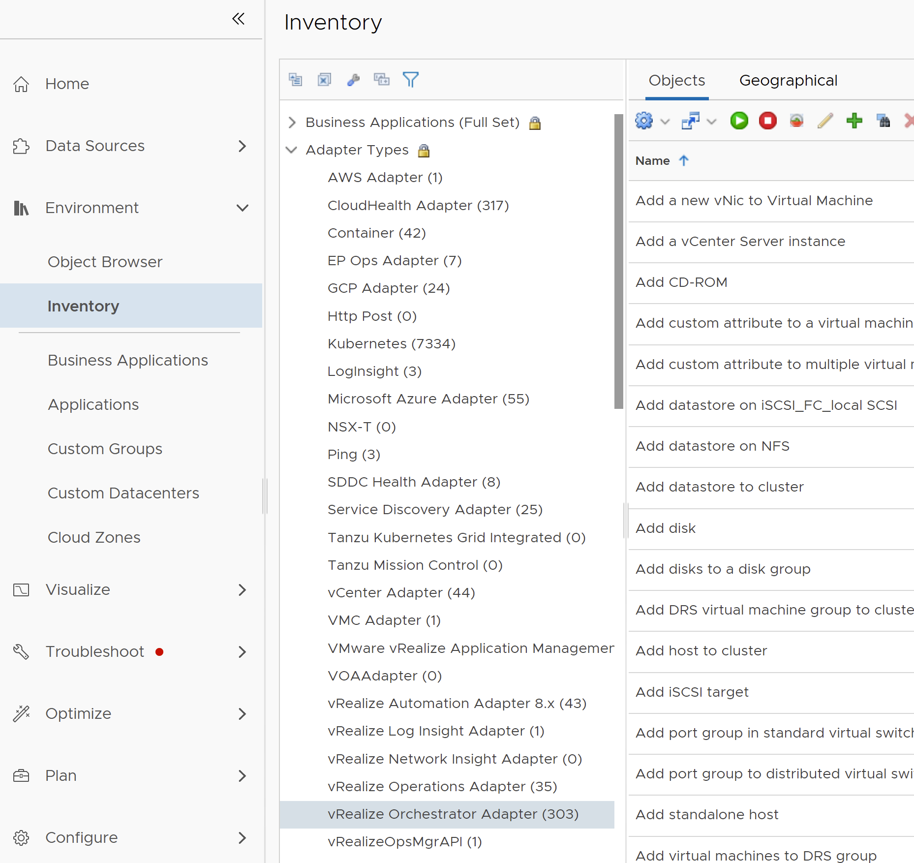

## Let's do the Policy work. 

1. Go to **Administration** > **Policies**, edit our active and default policy.  Select **Alerts and Symptoms** , find the Alert Definition associated with the Symptom/Recommendation/Action you want to automate, or just select all, click the ACTIONS drop down, **Automate** > **Enable**
2. 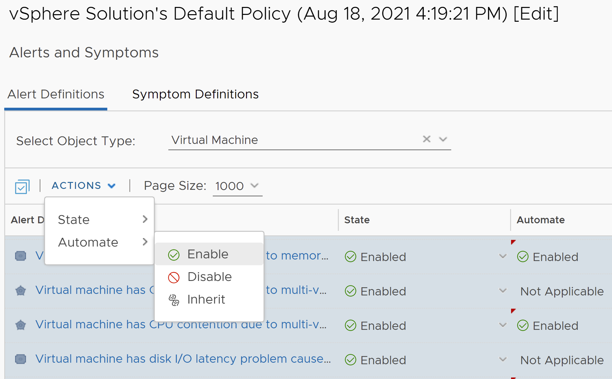

## Enable management pack in policies

Now we need to enable the Management pack for your policies so it can be used by the different vRealize Operations objects (meaning VM-s). 

1. In vROps goto **Configure, Policies**, and click on your <u>D</u>efault policy

   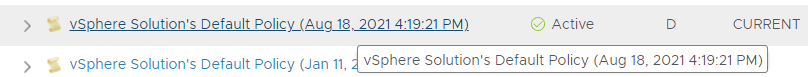

2. Click on **Edit Policy**
   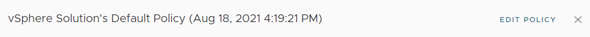

3. Click on **Groups and objects** and make sure **vRealize Orchestrator Adapter** is selected

   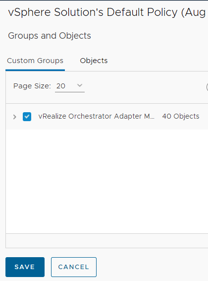

4. Click **Save** and exit the policies

 

  

## Prepare a Workflow to occur as an available action in vROPs. 

1. From the list of objects, choose **vRO Reboot VM**, and select **Create / Modify Workflow Action on vCenter Resources...** from the Actions menu
   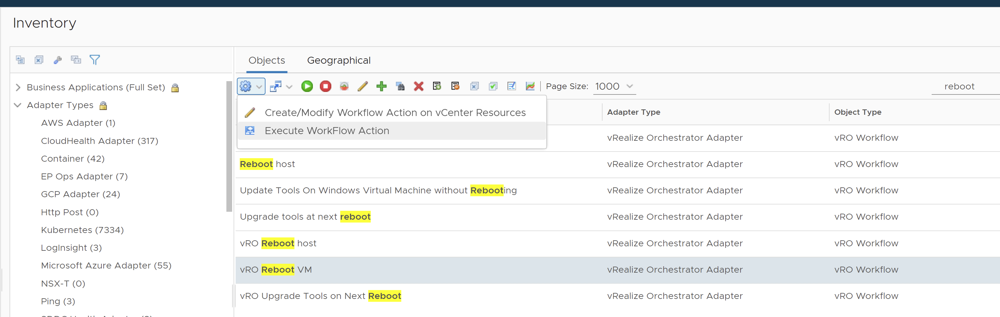
   
   

2. For Resource Type and Target Resource Type, Select **Virtual Machine**, for Operation Select Add, then click **Begin Action** and OK

   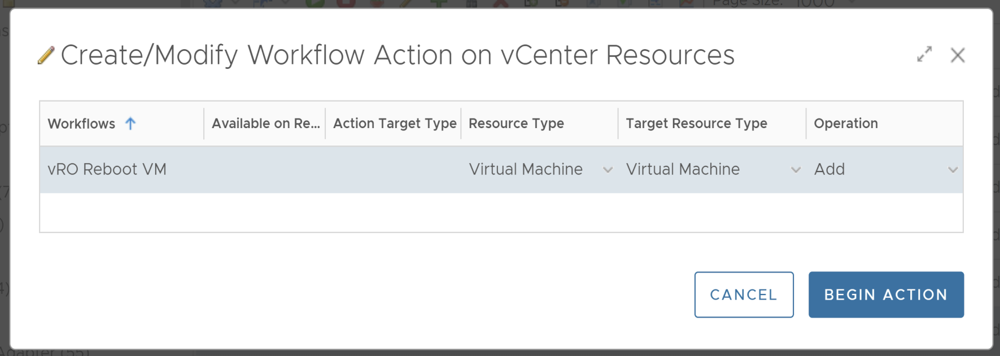

