# How I mistakenly did the Google integration
I noticed that Alexa was super responsive to my "turn off kitchen table" messages, but my Google were so slow. One day my little **Google home mini** just referenced me to some Nabu Casa stuff, and I suddenly realized "Hey, We're going through the web for this!!" = crap!
- Previously I had just incorporated Google under: http://homeassistant.local:8123/config/cloud/account and It works, but it's not what I want!! This is not local! This is using a subscription! This is extremely much faster and responsive for **Amazon Echo Dot Smart speakers using Alexa** 
- 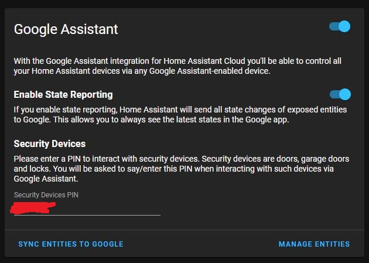 
# How I should have done it
It is *<u>not very trivial, neither intuitive</u>* to get this to work without the Home Assistant Nabu Casa support.  This requires a LOT of irrational funny steps and a lot of keyboard work on your behalf. But when you've gone through this you just keep on backing up your Home Assistant so you don't ever lose the config. You will require to set up the DuckDNS.org thing first. LMGTFU: [here](https://bfy.tw/SRGe)


1. **Create a new project** via the Actions on Google website, go to [console.actions.google.com](console.actions.google.com) 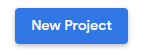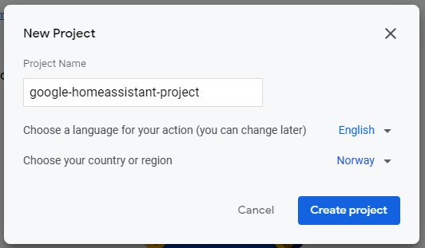

2. Select **Smart Home** and click on **Start Building**. 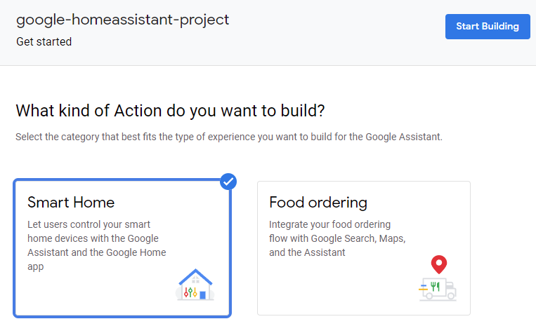

3. Under **Quick setup**, click on **Name your Smart Home action**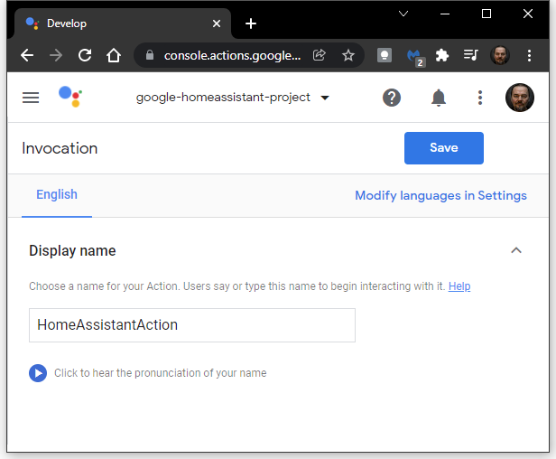

4. In the *top left* burger menu click on **Actions**.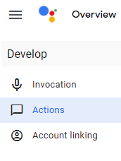

5. Put in a fullfillment URL. ie. your duckdns.org address  `"https://your-duckdns-name.duckdns.org:443/api/google_assistant"` - remember to use `port: 443`, and add the text `"/api/google_assistant"` at the end
    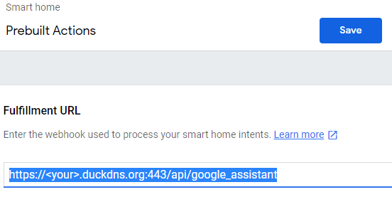

6. Click on **Save** 

   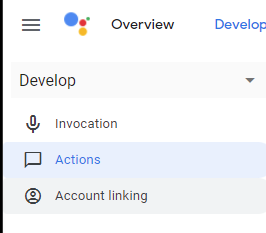

7. Before you continue, record your ***project ID*** from the Project settings under the burger menu on the Top Right and **Project settings**

   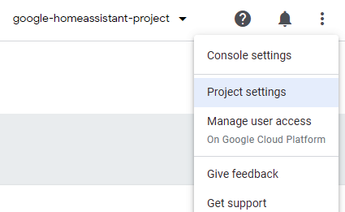
   *note*: To get back to the Account linking, you can click on **Develop**

8. Click on **Account Linking**
   Put in `https://oauth-redirect.googleusercontent.com/r/<project-ID>` and the  **project ID**  you recorded earlier. Also put in a **Client secret**. You would normally not need this password for Home Assistant to link to the Google Assistant.  Just use anything, for example *"HomeAssistant1!"* is as good as anything.

9. For the **Authorization URL**, you will add your duckdns URL and `Port 443`, like this: `https://your.duckdns.org:443/auth/authorize` 

10. For the **Token URL**, enter almost the same - but this time replace `/auth/authorize` with `/auth/token` like this: `https://your.duckdns.org:443/auth/token`  

    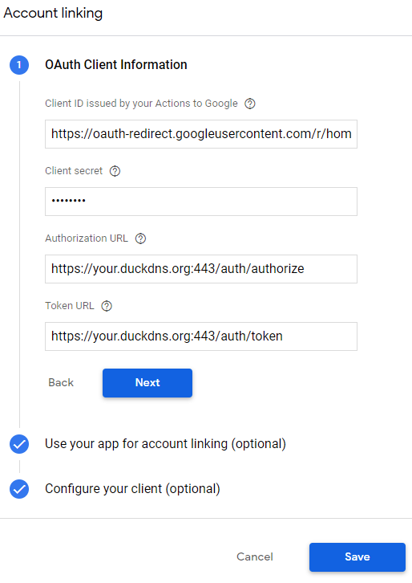

11. Click **Next**, Click **Next**

12. Under the "Configure your client (optional)"  enter **email** and click **Add Scope**, and add **name**
    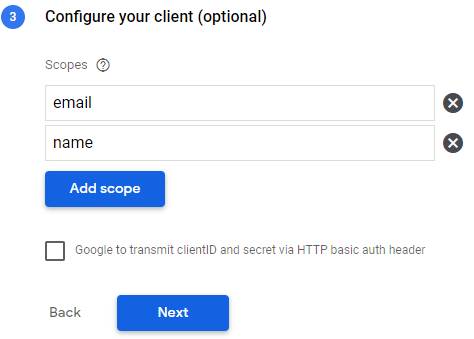

13. Click **Next** and then **Save**.

14. In the Actions Console click **Test**


    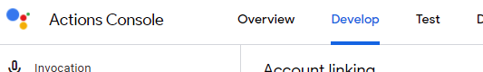


    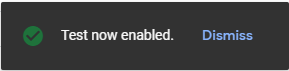

15. Type **CTRL+T** to get a new  browser tab, go to:  [Google Cloud API website](https://console.cloud.google.com/apis)

16. Select your project you created under **select a project** 
    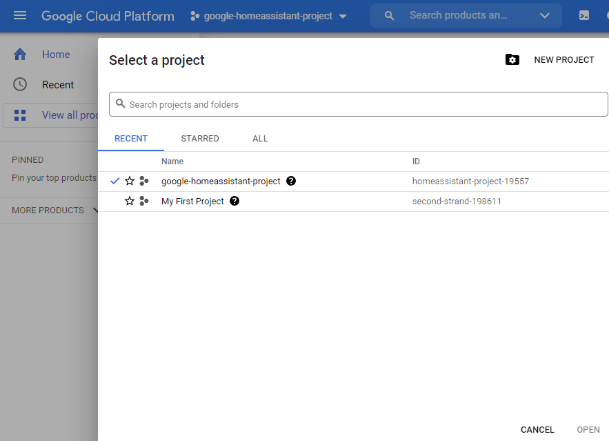

17. From the left menu, click **Credentials** and then click on **+ Create Credentials**, and select **Service account**

18. Put in a Service Account **Name**, it will serve as a Service Account ID, a display name, for example "Home Assistant Service Account" - you will autmatically get a **service account ID** for example: `home-assistant-service-acc-798`, Now click **create and continue** 

19. Under the Grant this service account access to the project, Use the Dropdown menu to Select a Role, choose **Service Account Token Creator**, 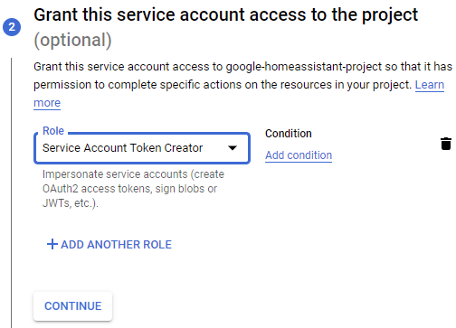

20. Click **Continue** and **Done**

21. We need to download the JSON file for the service account containing our logon information and such. to do this go to **Manage service accounts** : 

    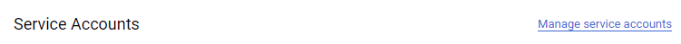

22. On the burger menu on the right of your service, select **Manage keys**  

    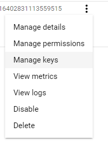

23. Drop down the **Add Key** menu and select **Create New Key**, then select **JSON** and **Create**

    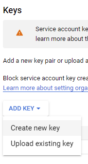

24. The  message "**Private key saved to your computer**" pops up, and suddenly you are the owner of a *.JSON file in your download folder, `homeassistant-project-xxxxx-yyyyyyyyyyy.json`. Click **Close**

25. Search for **HomeGraph API**, select it and cklick **enable** to enable it. 

    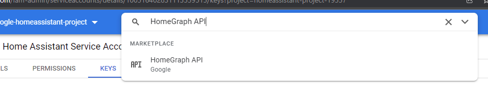

26. All configuration in Google is now done. I know this maybe didn't make sense, but now comes the easier stuff! Open up your http://homeassistant.local:8123 and use the **Studio Code server** to edit your `configuration.yaml` file. Add just one line:  `google_assistant: !include google_assistant.yaml`and then add the `google_assistant.yaml` file and get ready to put in some text into. Start with this: 

  > ```yaml
  > project_id: 
  > service_account:
  >   private_key: 
  >   client_email: 
  > report_state: true
  > exposed_domains:
  >   - switch
  >   - light
  >   - sensor
  >   - script
  > ```
  
27. Open your freshly downloaded **JSON** file, and copy and paste in the `project_id, private_key` and `client_email`

28. **Restart** Home Assistant to apply all the new changes. WE're not so far from the end now. After Home Assistant has restarted, you have to use your Android or iPhone and open the **Google Home App** and tap the top left **'+'** icon ', then tap Set Up Device, Choos **Works With Google**, find [test] HomeAssistantAction (my name from #3 where we selected the name for the action)

29. 