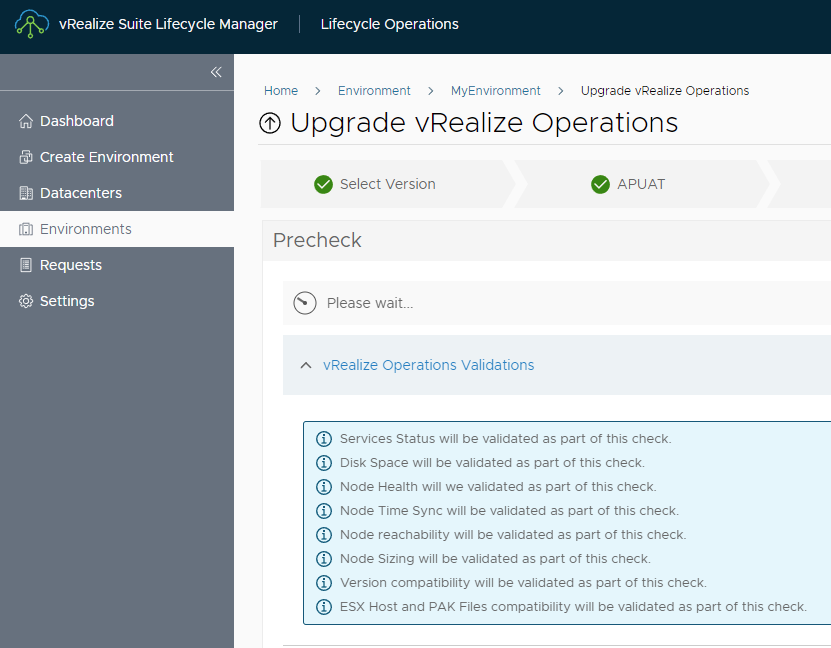
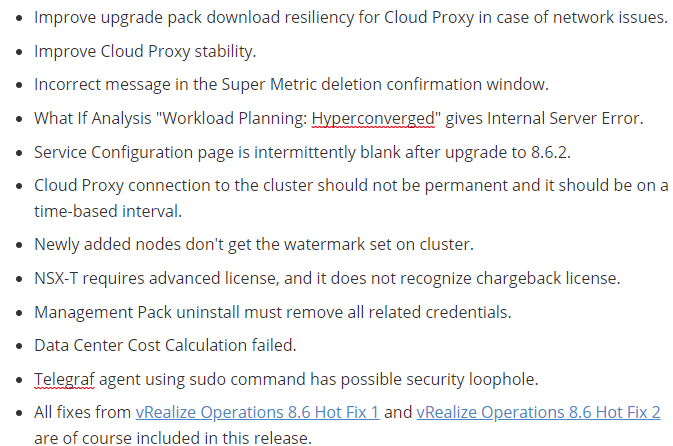
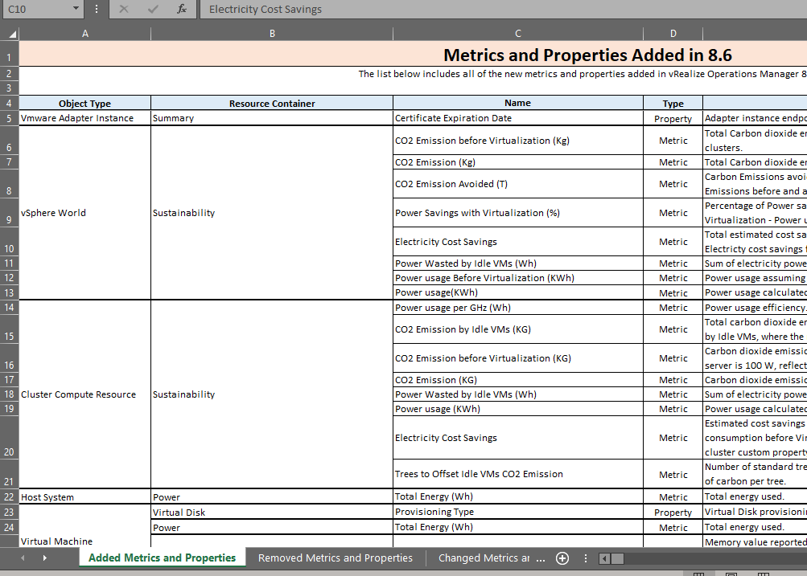
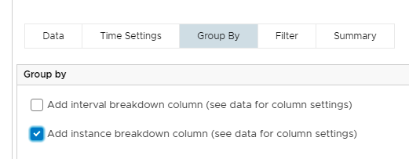
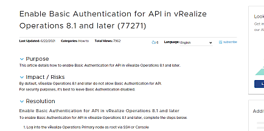

**Recently, VMware released new and improved vRealize versions. Let's have a look on vRealize Operations and the new v8.6.3 of the product**. 

This release from 8.6.2 to 8.6.3. is a is a **maintenance release** which resolves a few important security and functionality issues identified in the product For more details, see [KB 88081](https://kb.vmware.com/s/article/88081). There are *154 CVE's* (Common Vulnerabilities and Exposures) solved and fixed. I'd say it's quite a large update even if it feels minor. The following issues have been resolved as of vRealize Operations 8.6.3:

| upgrading is easy with Life Cycle Manager                    | Issues solved in vROps 8.6.3     |
| ------------------------------------------------------------ | :------------------------------- |
|  |  |

Let's highlight a few..

#### METRICS ####

There are some **new Metrics** added in this release. Some of these are related to the Energy, Emission, power usage, and waste, which implies that most of these new metrics surrounds the **sustainability dashboards**. Have a look at [Metrics added in vRealize Operations 8.6](https://kb.vmware.com/s/article/85834) where you can download an [Excel Spreadsheet](https://kb.vmware.com/sfc/servlet.shepherd/version/download/0685G00000Z5xqgQAB) with all the added metrics. 

#### INSTANCED METRICS

If you're using the *Breakdown by* and *Add instance breakdown column* you have probably used what we call **instanced metrics** under the *Group By* Tab when you have created a View (*Data*). These are now disabled by default, but can easily be re-enabled again. go to [KB 81119](https://kb.vmware.com/s/article/81119).

#### BASIC AUTH

Basic authentication using the REST API is deprecated and disabled in vRealize Operations 8.6.3 (thanks for that). If you still need to enable basic authentication, see [KB 77271](https://kb.vmware.com/s/article/77271).

#### AGENT MANAGEMENT PROBLEMS ####

That infamous Cloud proxy thingie:  After you upgrade vRealize Operations from 8.4 to a *anything*, content upgrade + agent management will fail - Yikes... I have had a personal problem with this, where I was unable to install Telegraf agents onto any Operative System, including all Ubuntu versions, CentOS, Windows 2019&2022 and more.  This is the Important Workaround:

1. SSH to the Cloud Proxy (or all your cloud proxies).
2. Run : *`/rpm-content/ucp/subsequentboot.sh`*

> Just do it even if you don't need to, trust me!  

#### LINKS

- [ ] Release Notes:  https://docs.vmware.com/en/vRealize-Operations/8.6.3/rn/vrealize-operations-863-release-notes/index.html
- [ ] vRealize Operations 8.6.3 Download Landing Page: https://customerconnect.vmware.com/downloads/info/slug/infrastructure_operations_management/vmware_vrealize_operations/8_6

... until next .. 

