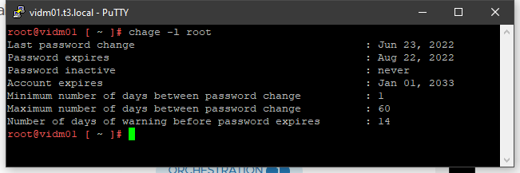
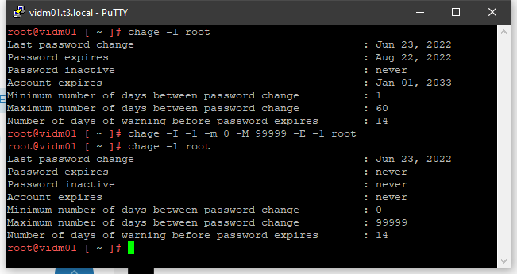

### **What's the problem?**

Normally a Virtual appliance (VA) in the vRealize Suite (VRS), will expire the root password you set under the installation in a year. Well, nothing dramatic about that. But, will you remember to change it next year? Maybe, if something told you in a GUI, mail or monitoring system that the password were going to expire. 

#### A monitoring dilemma

When the VA root password is expired it will prompt you to change it when you SSH into it. **Fine**. But how would you know if the password expires? AFAIK. There is currently no check for this in vRealize Operations manager or any of the other vRealize products. There might be a future health check for this, but as for now there is none. 

#### Changing passwords from Life Cycle Manager

You can request a change the VA root password in vRealize Lifecycle Manager (vRLCM) for the different products, let's say vRealize Automation.  vRLCM will then set up a SSH session and try to use the 'passwd' command. That would fail in the case the password has expired, because you would automatically be prompted to update the password.  On the other hand, if you were somehow informed some time before the passwords did expire. Changing passwords from LCM would be a walk in the park. 

#####  - inventory sync in LCM

If you do an inventory sync in vRealize Lifecycle manager, and your password has expired, there will be a very generic error message. This message is not very helpful to make you realize that the VA password needs changing.

#####  - other LCM tasks

Other LCM tasks i've been checking is for example to update a license. that also fails until the password has changed

### **What's the solution?**

1. Set the root password expiration for vRS solutions to Never.  
2. Change root passwords directly out of vRSLCM with just one request.

Both of these are still to come, and are not a implemented solution in vRLCM v8.8.1 

#### What you need to do:

1. log in to one virtual appliance with putty or any other SSH client
2. use the command `chage -l root` to see how long it is until the password expires
   
3. As you can see, a disaster is about to hit me. I want to set this password to **never expire** . use this command to do that: `chage -I -1 -m 0 -M 99999 -E -1 root`  then run the `chage -l root`  to see the results :
   

#### The FUN

Now comes the fun. You have to do this to every single product individually, so repeat the task above for all you vRealize products virtual appliances, VRA, VROPS (all nodes, including Master, replicas, cloud proxies etc.), VRLI, VIDM, VRLCM, etc. 

#### The big "What-If"

What if you upgrade the virtual appliance? Will the change we made, be **reset**? Some say YES but I haven't tested that yet. I'll update this article with the results after an upgrade. Tweet me @bgronas if you know the answer and have tested it https://twitter.com/bgronas

**You, the expert**

You might be a Linux expert that see a cool solution with a script or an easy solution to this problem. 

In that case tweet me `@bgronas`
