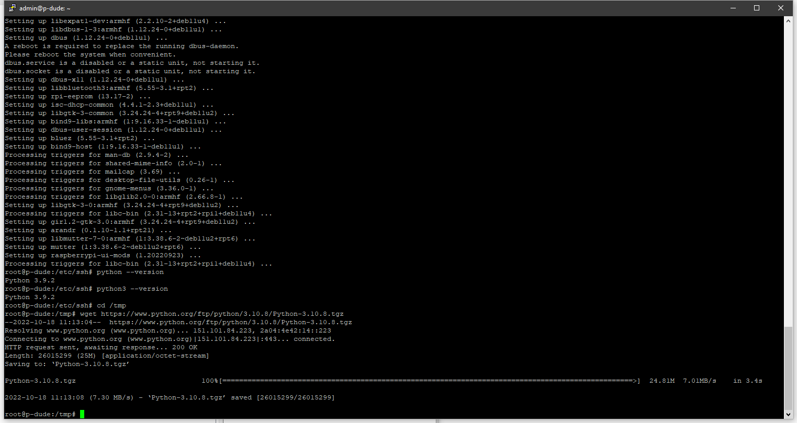
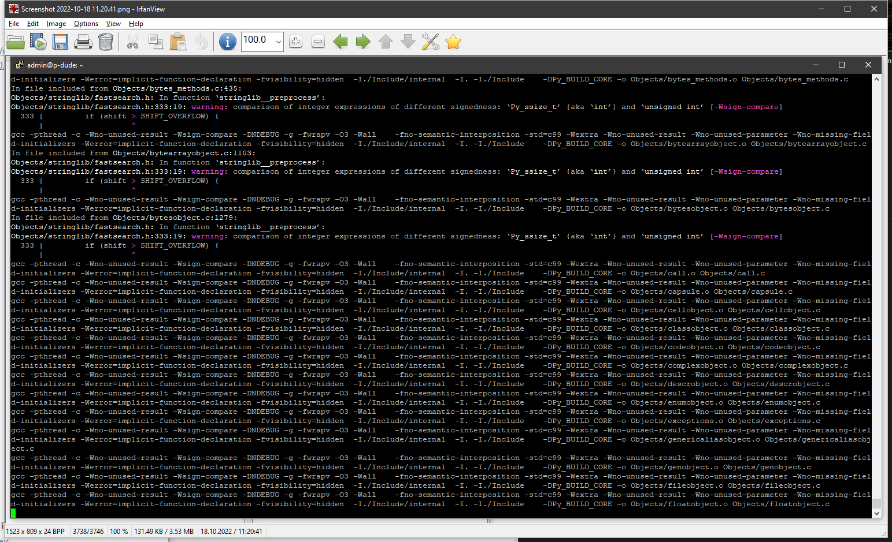
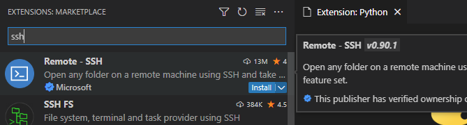
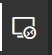
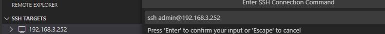
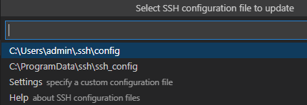
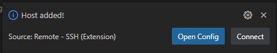
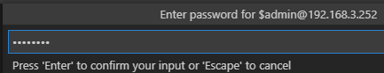
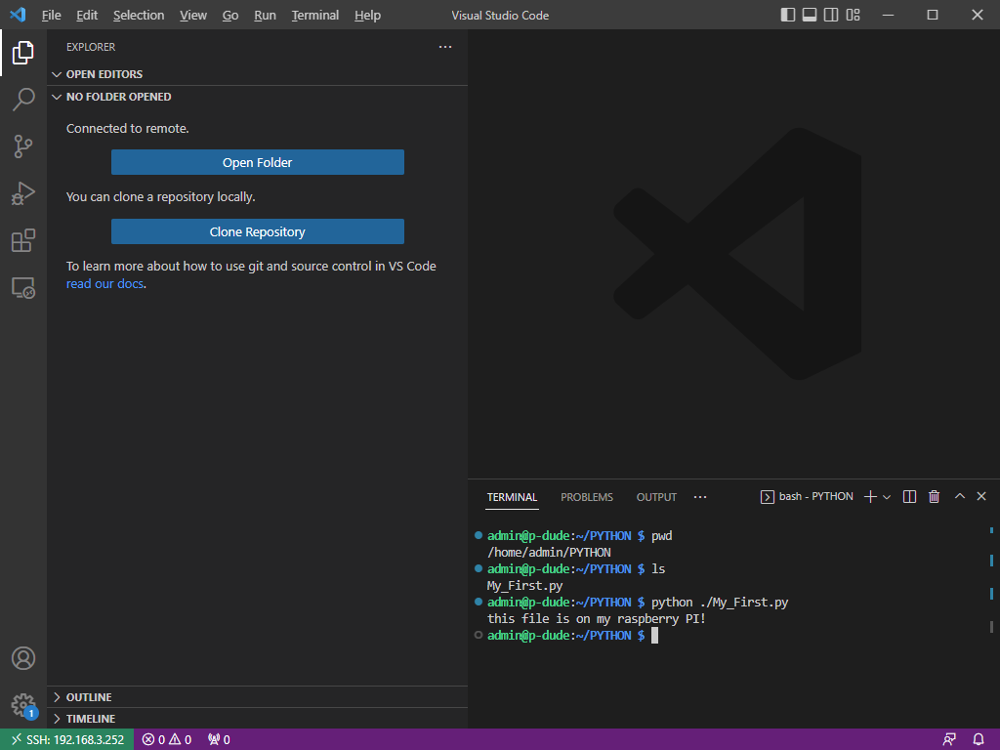
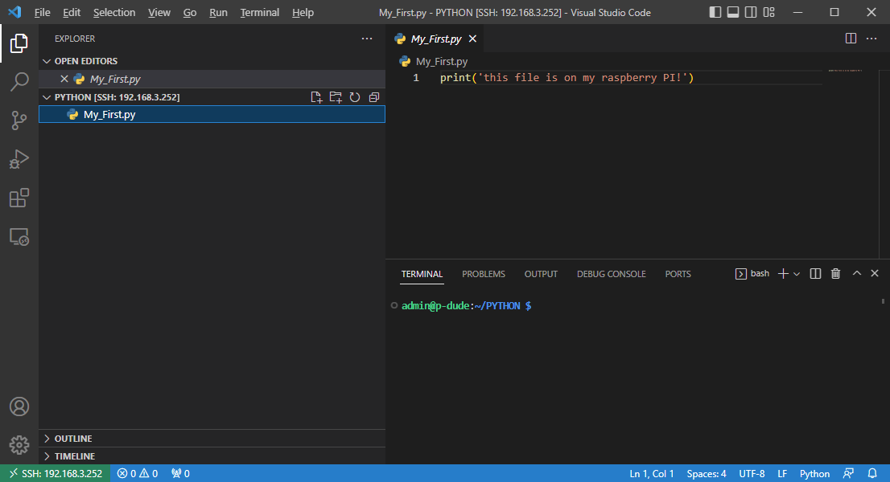

## How-to set up Python on Pi
The goal of this little article is to show how I installed Python on raspberry PI.  There are lot's of articles out there on the subject, but since I am a beginner, I am running through everything I find useful for  my self and as a later notice to myself. This saves med the time and hassle to find the recipe or how-to next time. Plus, I know what worked for me. 

 ### Where can I find Python? 
https://www.python.org/ is a good place to start. The Python versions can be found here:  https://www.python.org/downloads.  The one I've found and selected for Linux (Raspberry Pi) is : https://www.python.org/ftp/python/3.10.8/Python-3.10.8.tgz take with you this one to the next steps. 

After you've logged in to your Raspberry Pi thing...
### How do I check my Python version?
`python --version` 
`python3 --version`

### How do I set up a python on RPi?
* `cd /tmp`
* `wget https://www.python.org/ftp/python/3.10.8/Python-3.10.8.tgz`

* `tar -zxvf Python-3.10.8.tgz`
* `cd Python-3.10.8`
* `./configure --enable-optimizations (Takes approx. 2+ minutes)`
* `sudo apt update`
* `sudo apt install -y build-essential tk-dev libncurses5-dev libncursesw5-dev libreadline6-dev libdb5.3-dev libgdbm-dev libsqlite3-dev libssl-dev libbz2-dev libexpat1-dev liblzma-dev zlib1g-dev libffi-dev`
* `sudo make altinstall (easily took 25+ minutes)`

### How do I link?
`cd /usr/bin`
`sudo rm python3`
`sudo ln -s /usr/local/bin/python3.10 python3`

`cd /usr/bin`
`sudo rm python`
`sudo ln -s /usr/local/bin/python3.10 python`

### How do I upgrade python later?
easy..

`sudo apt update`
`sudo apt upgrade`
#### Visual Studio Code (vscode)
Now that you've installed Python it's time to link Visual Studio Code to your freshly installed Raspberry Pi, so you can noodle around with python on your little python based server.

* `Start` vscode and search for ssh in the extensions marketplace

* In the left side of vscode click the SSH icon:

* Click the + icon, and enter "ssh logon@serverIP and press enter":

* Select your config file c:\users\admin\.ssh\config:

* The host will be added:
!

* Click connect and Enter your password:
  

* Now you have a connection to your Raspberry PI:
  

* Click Open Folder to start editing files on your PI :
  

### Why not a virtual machine with some Linux distro on
Now you can go and have a blast with your python projects on your local PI. You may argue I should have had the free VMware ESXi server, the VMware Workstation or ProxMox server to host a virtual machine on, but as of now I had an extra Raspberry PI lying around, and I wanted to make use of it for some python noodling and see what it was good for without having a larger machine running.  Another way is of course to install the windows version on your local Windows (or mac) to run all projects locally, but then again, to keep a clean slate, I did it *myyyyyyy waaaayyy.* 

  
