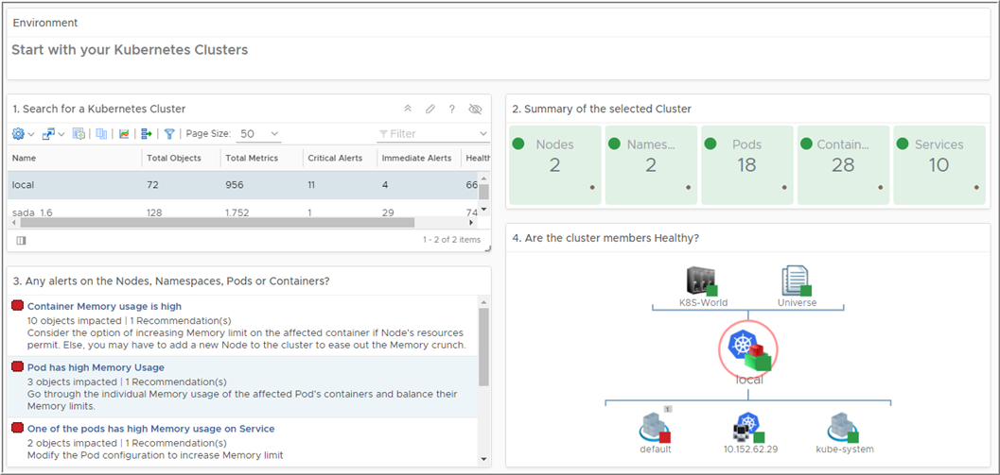
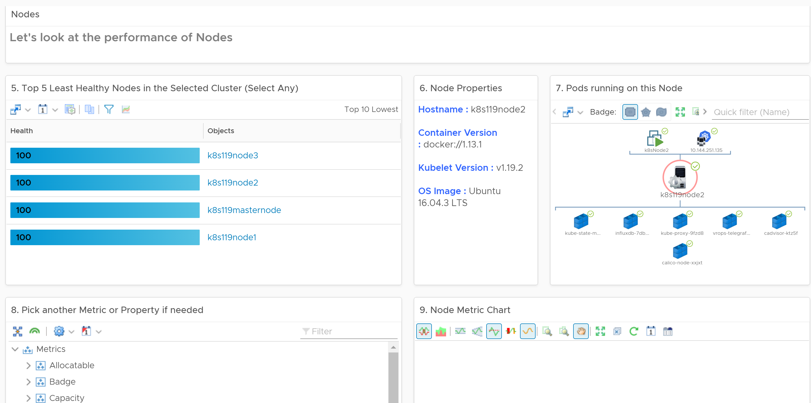
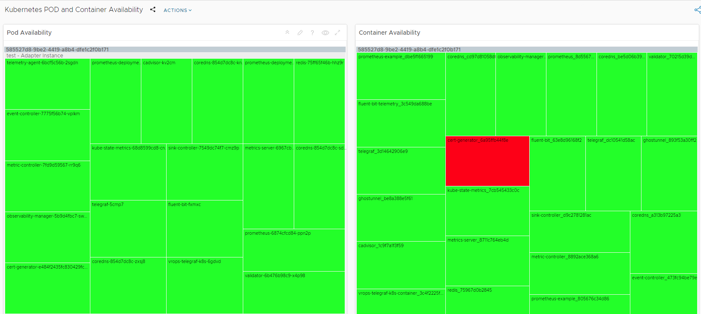

## Monitoring K8s with VMware 

Monitoring is an essential part of *DevOps*. As enterprises are using Kubernetes, they would need all the capabilities they leverage today for virtual machines. Starting from discovering the Kubernetes clusters, creating an inventory, defining relationships, and finally collecting all the key metrics and events to provide full visibility and do Troubleshooting and Root Cause Analysis.

You can use **vRealize Operations** to monitor your open-source container orchestration system **Kubernetes** environment.  Why wouldn't Prometheus & Grafana be enough? Well, Aria Operations formerly known as vRealize Operations can do so much more than just monitor Kubernetes, but we're not going to talk about that in-depth here. Even if Grafana in the end will give you some charts, graphs, and alerts regarding your Kubernetes environment, you would want to use vROps or Aria Operations for the task. This will save you the hassle of maintaining the various solutions required and maybe even have separate people for separate expertise. 

As much as i love fiddling and noodling with open source stuff, I wonder if you're better off with a complete solution. *I mean if you were a pianist, would you build your own piano?*

## vRealize Operations Management Pack for Kubernetes ##

VMware has announced that vRealize Operations Management Pack for Kubernetes v1.8 is GA as of November 14, 2022! This is an upgrade of a technology that has been with us for many years. This includes the support for Red Hats Kubernetes version and **any open-source Kubernetes!**, also referred to with the popular term "upstream kubernetes"      When you combine  vRealize Operations Management Pack for Kubernetes with **Prometheus** you can monitor your data from end-to-end. vRealize Operations Manager retrieves the metrics directly from Prometheus with the help of exporters running on the Kubernetes cluster. vRealize Operations Manager supports metrics collection for following **Kubernetes services, Namespace, Nodes, Pods, and Containers** with Prometheus integration. The following sample deployment setups are available in vROps: cAdvisor, cStatsExporter, Telegraf Kubernetes Input Plugin, Kube-State-Metrics, Windows Node Exporter, and Node Exporter.

## vRealize Operations dashboards
An overall view of Kubernetes adapter instances, its associated objects information, alerts, and health status of objects. You would see Any Alerts on the Nodes, Namespaces, Pods or Containers. Are our <u>cluster</u> members <u>healthy</u>? 

A detailed set of information of the nodes and pods, node or pod properties, <u>health status</u>, metrics, and hierarchical representation of pod relationship, metrics and so on 

A heat map detail for the PODs and Containers of a cluster. This immediately show the POD and Container <u>availability</u>. You can view all the details about the PODs and Containers associated with the entire cluster 

## What's New?

**• Support for the following integrated versions in the vRealize Operations Management Pack for Kubernetes:**

- Upstream Kubernetes 1.19 - 1.24
- Tanzu Kubernetes Grid Integrated 1.12 - 1.15
- Tanzu Kubernetes Grid 1.4, 1.5.1, 1.5.2, 1.5.3, 1.6.1
- vSphere with Tanzu v1.18.5+vmware.1.tkg.1 and v1.21.6+vmware.1-tkg.1.b3d708a
- Red Hat OpenShift 4.8 - 4.10

** View Kubernetes Deployment workloads as a separate object with relationships to the Namespace and Pod objects**
** An XML based configuration that can be edited from the vRealize Operations to manage collection of custom Prometheus metrics. It can be used to configure the following:**
- Map Prometheus metrics to Kubernetes objects
- Map recording rules to metrics and Kubernetes objects
- Control ingestion of Prometheus labels and set up levels for metrics
- Automatic handling of SSL certificates for auto-discovered Kubernetes clusters in the following distributions

- VMware Tanzu Kubernetes Grid Integrated Edition
- VMware Tanzu Kubernetes Grid
- Clusters deployed via VMware Tanzu Mission Control (TMC)
- Additional properties for Kubernetes objects to track configurations

## Documentation ##
- vROps Management Packs *Release Notes*:  [vROps Management Packs Release Notes](https://docs.vmware.com/en/Management-Packs-for-vRealize-Operations/services/rn/release-notes-for-vrealize-operations-management-packs/index.html)
- vROps MP for Kubernetes 1.8 *Documentation*: [vROps MP for Kubernetes 1.8 Documentation](https://docs.vmware.com/en/VMware-vRealize-Operations-Management-Pack-for-Kubernetes/1.8/management-pack-for-kubernetes/GUID-BD6B5510-4A16-412D-B5AD-43F74C300C91.html)

## Where to download
*Marketplace*: [vROps MP Kubernetes 1.8 Marketplace Link](https://marketplace.cloud.vmware.com/services/details/vrealize-operations-management-pack-for-kubernetes-1-8-1?slug=true)

`#DevOps`
