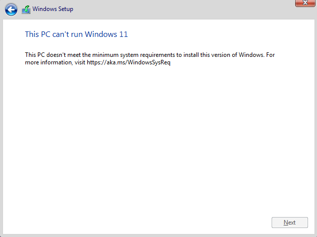

# The problem

The goal and purpose was that I needed to bypass the "**This PC can’t run Windows 11**" problem during an installation of a Windows 11 Virtual Machine (VM) in my test environment.  This DIY recipe will save us the hassle of googling it once again and sorting out the correct article to try out.

### This PC can’t run Windows 11

This happens during an install:

# The Solution

1. Go back one step by clicking **top-left blue arrow** 
2. press '**Shift+F10**'
3. in the CMD box, type '**regedit**' and press **enter**
4. in the registry editor Navigate to “HKEY_LOCAL_MACHINE\SYSTEM\Setup”
5. Right click Setup, Choose New Key, and Name it "**LabConfig**"
6. Under LabConfig, add all these values as **DWORD (32-bit) Values** and set the data to **1**

- `BypassCPUCheck`
- `BypassRAMCheck`
- `BypassSecureBootCheck`
- `BypassStorageCheck`
- `BypassTPMCheck`

After all these manual inserrtions are done, you are ready to continue the fight of installing Windows 11. 

1. **Close** regedit
2. **Exit** the DOS command prompt 
3. **Continue** your installation!

remember to smile 
