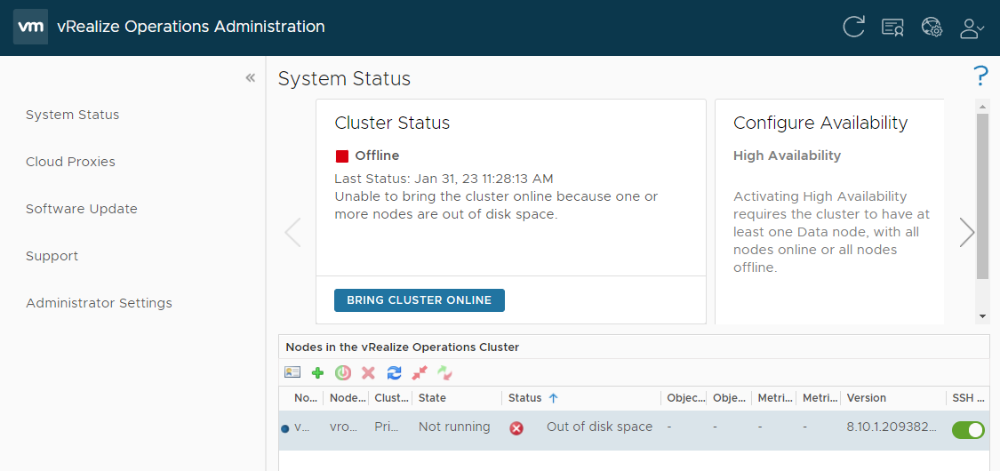
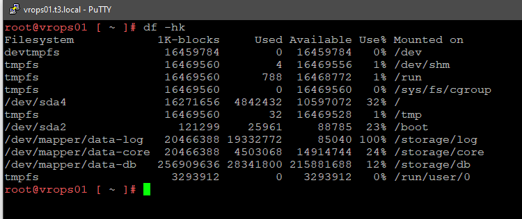

**What if you are Unable to bring your vRealize (Aria) Operations cluster online because one or more nodes are out of disk space. Let's see if the log disk is the problem and try to fix it**

The goal is to find out if the Log disk is full and how to clean it and hopefully you save some time with this mini-Recipe that will show you how to investigate the "Unable to bring the cluster online because one or more nodes are out of disk space." error in the Admin console of vRealize Operations and what to check.

## The Admin Console

From the admin-gui `https://<vropsFQDN>/admin`, my cluster is not running, it is out of disk space, I am running vrops v8.10, and SSH is enabled. If SSH is not enabled, do it now. We also see the same above from the *cluster status* "Unable to bring the cluster online because one or more nodes are out of disk space".  Note: If you should force it online now, nothing would happen and the status would end up exactly the same.

## SSH to vROps, check space

You can use putty or a windows command line to SSH into the vrops virtual appliance instance. After you've logged on, go ahead and issue a `df`, or `df -hk` command to check the disk space:

As you can see the `Use%` for one of the file systems are sky high, in fact 100% filled. Let's see if we can do some remedy on `/storage/log`, before we go through the trouble of adding or increasing any disk space. 

## Shave the logs

1. `service syslog stop`
2. `rm -f /var/log/warn* /var/log/auth.log* /var/log/messages*`
3. `service syslog start`
4. `find /storage/log/ -mount -type f -mtime +1 -exec echo {} \; -exec truncate -cs 0 {} \; 2>&1 | tee /tmp/files_truncated.txt`

## what now?

Check if it worked by issuing a new `df -h` command like above. If the file systems are OK, go ahead and start the cluster from the admin console. <u>Note; You should actually bring it down again and up again to see if the cluster is OK.</u>

## Articles

[Troubleshooting Storage Issues in vRealize Operations (83239)](https://kb.vmware.com/s/article/83239)

[How to safely clean /storage/log in vRealize Operations (2145578)](https://kb.vmware.com/s/article/2145578)

