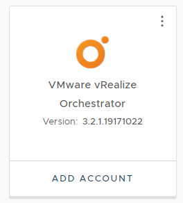

## Objectives

The goal and purpose is to show how to connect vRealize Orchestrator to vRealize Operations to later be able to do actions and remedies based on alerts in vRealize Operations. You can then also run Orchestrator workflows directly from vRealize Operations objects.  I hope this little article with it’s two cruicial tips will save you time and hassle and to easily be successful. 

## Prerequisites

1. **vRealize Orchestrator** installed. My Orchestrator is installed with vRealize Automation or you can download your standalone version from [Customer Connect](https://customerconnect.vmware.com/) Look under "Download VMware vSphere" (vRO is free with vCenter). 
2. **vRealize Operations** installed. I used vRealize Lifecycle Manager and deployed VROPS from there. 
3. **vRealize Operations management pack** go to the marketplace and search for "Management Pack for vRealize Orchestrator". I will be using version 3.2.1 of the Management Pack for vRealize Orchestrator. The file name is: *"[vmware-mpforvro-3-2-1-19171022-pak](https://marketplace.cloud.vmware.com/services/details/management-pack-for-vrealize-orchestrator11-11?slug=true)"* 

## Documentation

I recommend to read this thoroughly, because not every step will be explained here. At least go to the [Overview to see all the steps]() and the [Configure](https://docs.vmware.com/en/VMware-vRealize-Operations-Management-Pack-for-vRealize-Orchestrator/3.2/vrealize-orchestrator/GUID-CE89A064-09D8-4412-9903-9604A09BD0EF.html) section.

## Add the management pack. 

Open vROps, log in, and go to Data Sources>Repository, and Click "Add", then Browse for the management pack and select Reset default content and make sure you overwrite a potential older management pack. Just follow the Wizard.

## Configure (add a connection)

Go to **Data Sources** > **Integrations**, **Repository**, and then click **Add**. Select the VMware vRealize Orchestrator management pack and click **Add Account**. 

Fill in your values for Name, Description, vRO (really the VRA) host, Port 443, Auto Discovery: true, and the parameters that are right for your environment under the credentials, click the ‘+’ to add a credential. 

Accept the certificate, and Click  **Validate Connection** to validate the connection. 

Either it validates OK, but here’s my tip if you don’t succeed and get an error like this:  

## Enabling basic auth on vRO

Enable [basic auth in vRO](https://docs.vmware.com/en/vRealize-Orchestrator/8.11/com.vmware.vrealize.orchestrator-install-config.doc/GUID-30026BCF-DC1F-471E-A63C-A29E85FBDD41.html) - https://vRA_vRO_fqdn/vco-controlcenter . Add a [new property](https://docs.vmware.com/en/vRealize-Orchestrator/8.11/com.vmware.vrealize.orchestrator-install-config.doc/GUID-30026BCF-DC1F-471E-A63C-A29E85FBDD41.html)   *com.vmware.o11n.sso.basic-authentication.enabled* and set it to *true*

 

note: it will reboot your vRealize Orchestrator server. Just wait for that. It's time for a coffee. 

If you encounter connectivity issues between vRealize Operations and vRealize Automation, you may need to wait for 6-10 minutes for Orchestrator to come back online. Once it's online, you can retry the **validate connection** process from vRealize Operations to vRealize Automation. This should help you achieve success.

After validating the connection, it's important to check the Collection Status to ensure it's OK before proceeding to the next step. To do this, go to the Solutions page and verify that the Collection State column and Collection Status are **green** under Configured Adapter Instances. Note that the Collection Status will initially display *Data Receiving* after the first collection cycle, which is every 5 minutes.

## Add a vCenter

The **Hot Tip** when you’re [adding your vCenter](https://docs.vmware.com/en/VMware-vRealize-Operations-Management-Pack-for-vRealize-Orchestrator/3.2/vrealize-orchestrator/GUID-E3B25D81-7B09-40E4-9F74-206FDBADD96A.html) is to make sure you do `not` specify the **session per user** property.  If you are 100% sure you got the contents of the previous item no.4 you can continue to the next step. 

`Environment>Object Browser>Environments>VMware vRealize Orchestrator, then click [your connection]`

On the **actions** menu you now see the choices that needs to be performed

Select Add a vCenter, and fill in your values to configure your properties. Make sure you Unselect “Session per user”, and then click **Begin Action.**

## Import Workflows

`Environment>Object Browser>Environments>VMware vRealize Orchestrator, then click [your adapter instance]` .  On the **actions** menu select **Import vRealize Operations Remediation Package to vRO**.   There’s no other magic here, but to select “**Overwrite Package**” and the click on **Begin Action**. It notifies you this may take 5 minutes. Well, in my case it went 20 seconds. 

## Package Discovery

Back to the `Environment>Object Browser>Environments>VMware vRealize Orchestrator, then click [your adapter instance]` .  On the **Actions** menu select **Configure Package Discovery**, and then click **Begin Action**. Again there is no tip or magic here. This should tak just a few seconds. 

## Get Workflows onto the Actons Menu

You can map custom and user-defined workflows to actions. Repeat the task to add one workflow to more than one resource. You can perform this task for multiple workflows simultaneously within a package by running the same action on a package resource.

<– Let’s see what actions are already there. On the search menu on top, find a windows or Linux VM. In my example I’m found my tes VM called  *win11*

As you can see from the list, I’ve already got lots of items there, but now I’d like to add more actions I can perform. 

Again, go to `Environment>Object Browser>Environments>VMware vRealize Orchestrator, then click [your adapter instance]` .  On the **actions** menu select **Create/Modify Workflow Action on vCenter Resources**. Let’s select One that’s not in my list already, Let’s try the “**Rename virtual machine**”. 

Then just Click: **Begin Action**

This might take some time and you might hit refresh a few times after the task has ended. But in the end you’ll end up with a new and improved Action menu. 

## End Words

- What If I could use these actions as an Automagical Remedy if something happens in my environment?

- You can map custom and user defined workflows (actions) to alerts via recommendations.

- After you perform this mapping, you can execute the vRealize Orchestrator workflow to **remediate** issues when vRealize Operations displays alerts. Out of the box workflows, in vROPS are automatically mapped to alerts, so before you start mapping alerts to workflows, check out the [*out of the box* workflows](https://docs.vmware.com/en/VMware-vRealize-Operations-Management-Pack-for-vRealize-Orchestrator/3.2/vrealize-orchestrator/GUID-285CC980-B811-45BE-8B34-D192CE064895.html#) and corresponding recommendations and alerts. 

- Do you have an article describing how to do it?  Yes, 

  [Just]: ..…

  
