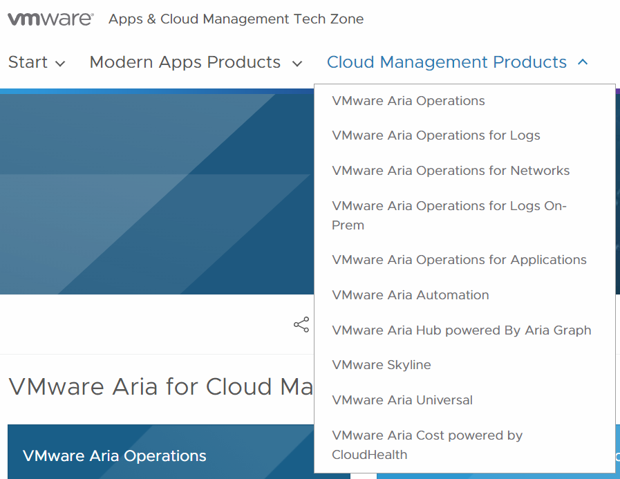

# Dead or alive?  

Is Pathfinder dead and Techzone next? Maybe. 

## What am I talking about?

For some time, VMware have had a collection of resources assembled as a collection in a one-stop-shop for resources such as videos, blogs, articles and training for all the cloud management products. Even the [Hands-On Labs](https://labs.hol.vmware.com/) have had links on these pages. This collection was called PATHFINDER:  https://pathfinder.vmware.com.  Now there has emerged another good one, that will more or less take over the whole she-bang, called TechZone. You’ll find the cloud management stuff at TechZone at [this LINK](https://apps-cloudmgmt.techzone.vmware.com/cloud-management)

## Get going

To get you started on the **Cloud management Products** Try out the top menu:

## Refine Search / filter

