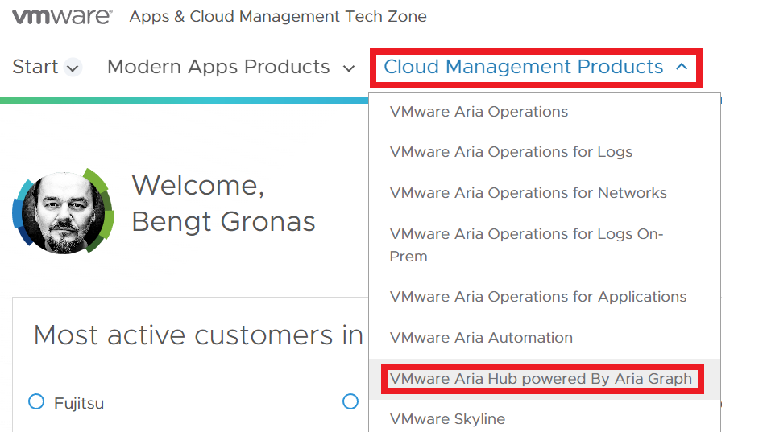
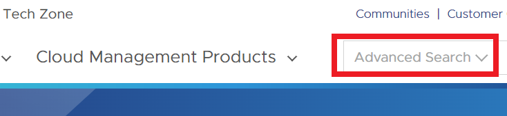
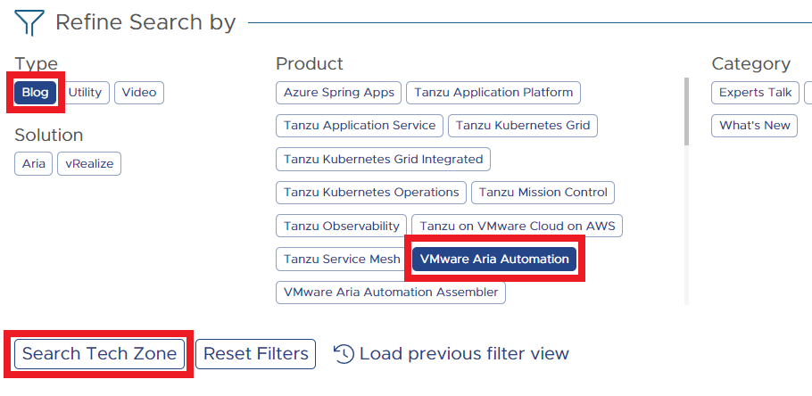
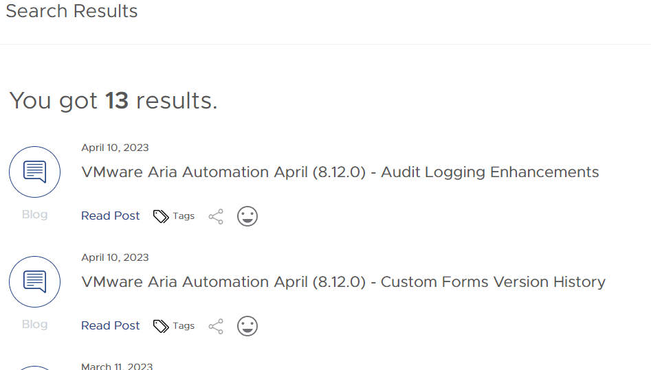
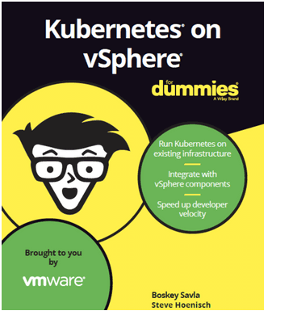

# Dead or alive?  

Is the good old Pathfinder dead and Modern Apps and Cloud Management **Techzone** next? Maybe, or maybe it isn’t

 

## What am I talking about?

For some time, VMware have had a collection of resources assembled as a collection in a one-stop-shop for resources such as videos, blogs, articles and training for all the cloud management products. Even the [Hands-On Labs](https://labs.hol.vmware.com/) have had links on these pages. This collection was called [PathFinder](https://pathfinder.vmware.com.)  

Now there has emerged another good one, that will more or less take over the whole she-bang, called [TechZone](https://apps-cloudmgmt.techzone.vmware.com/). 

# Modern Apps and Cloud Management Tech Zone

**You’ll find the cloud management stuff at TechZone at [this LINK](https://apps-cloudmgmt.techzone.vmware.com/)** !  <—– 

**Log in** using either a cloud account or your customer connect account

## Get going on Cloud Management

To get you started on the **Cloud management Products** Try out the top menu:

## Refine Search / filter

In the search field click the down arrow on **Advanced search**

Let’s say you are interested in **blog** articles about **automation**:

That’ll get you some results about interesting **articles**:

# Other Searches to try

Product: *VM Aria Operations* AND Category: *Deep Dive*

Type: *Video* AND OS/Platform: *GCP*

Type: *Utility* AND Category: *Quick-Start*

 

  

# Conclusion

So now you know :-) 
