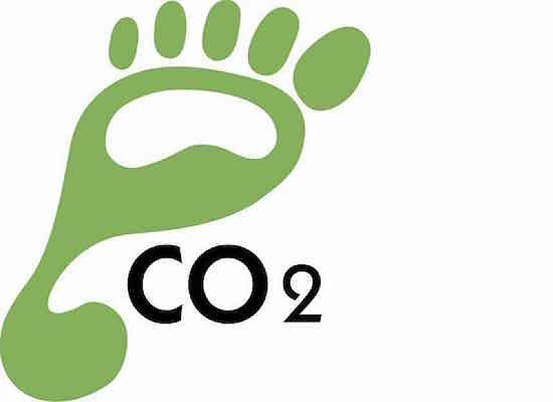
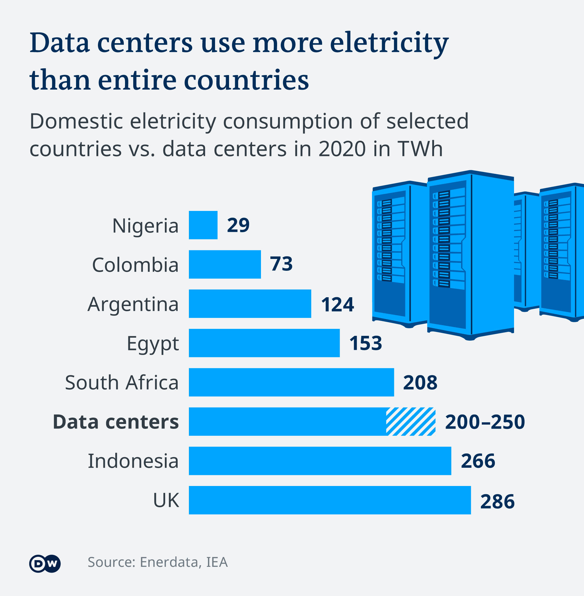
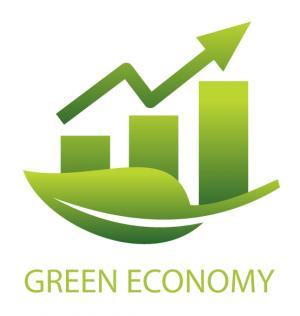
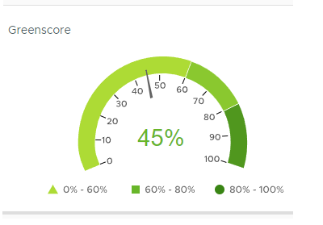
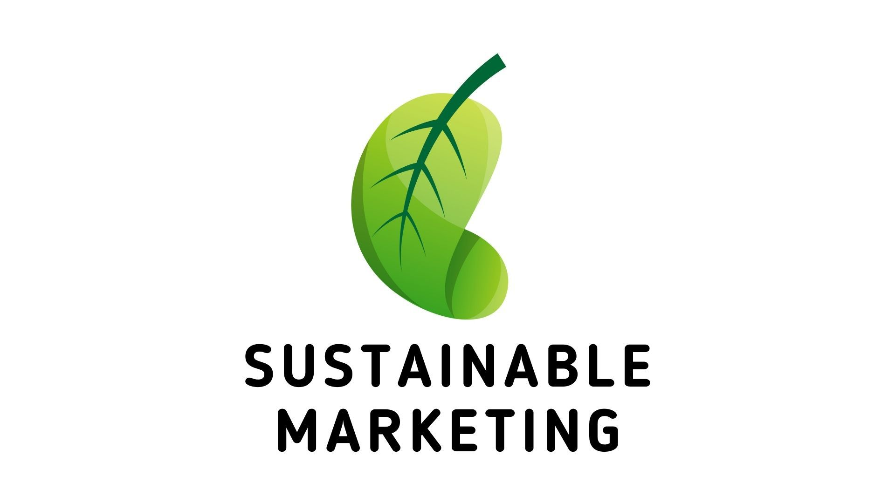
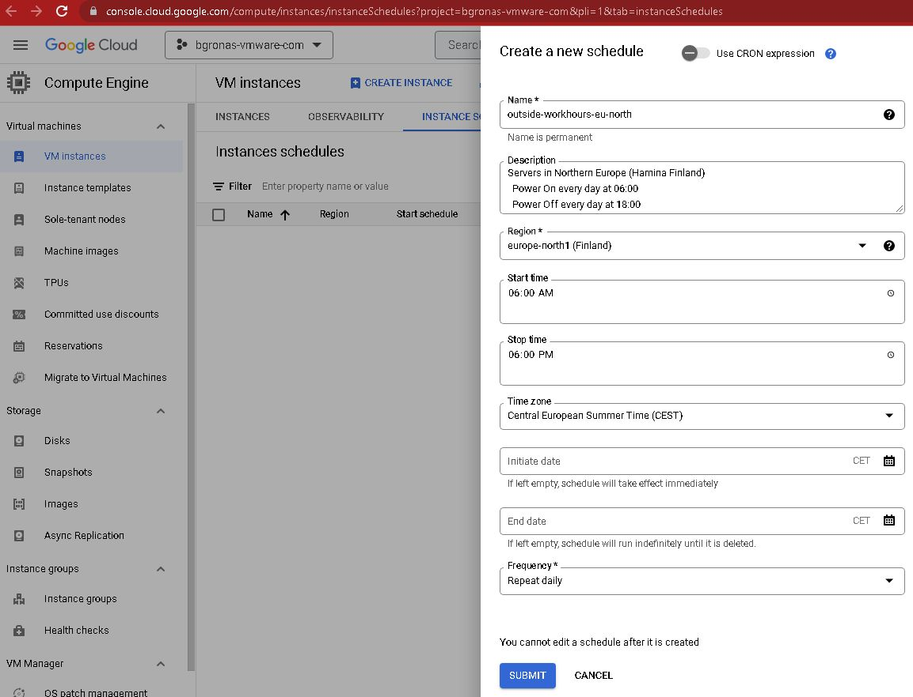
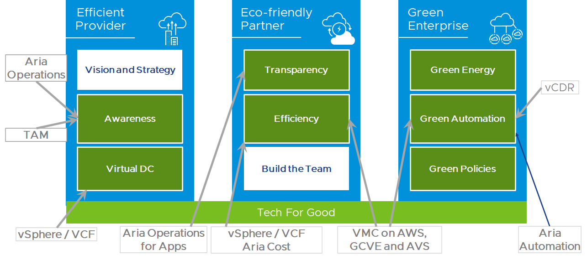

# **Powersaving in our datacenter**

**The goal and purpose of this article is to discuss “the WHY” in Powering off and Powering On VMs based on regular Schedule, just the way Google GCP, AWS, and Azure does it with VMs**. Why would we implement Sustainable Practices to meet our sustainability goals? 

This article is divided into Two parts:

- [IaaS Automated Powersaving, Green Sustainability - Pt.1](https://bengt.no/post/2023-03-27/)
- [IaaS Automated Powersaving, Green Sustainability - Pt.2](https://bengt.no/post/2023-04-16/) 

#### This is the first article containing the WHY. 

Note: If you want to go ahead and implement everything immediately without further knowledge, please head over the article [IaaS Automated Powersaving, Green Sustainability - Pt.2](https://bengt.no/post/2023-04-16/) 

## Cloud sustainability and carbon footprint?

You can always argue and debate the various Hyperscaler Cloud computing platforms, such as Amazon Web Services (AWS), Microsoft Azure, and Google Cloud Platform (GCP) about if they already have taken steps towards sustainability and are helping us go green by reducing their carbon footprint, supporting renewable energy development, and developing innovative green technologies. 

Some of the known statements are:

- AWS (Amazon Web Services). Amazon is committed to being carbon neutral by 2040
- Azure: Microsoft has set a goal to be carbon negative by 2030 and to remove all the carbon it has emitted since its founding in 1975 by 2050
- Google Cloud Platform (GCP): Google is the leader in sustainability initiatives and has been carbon neutral since 2007.
- What about the multi-cloud company VMware?  VMWare did commit to being carbon neutral by 2022, and made it earlier than expected. 

## Hyperscalers are power saving

Hyperscalers use many combinations of power management techniques to optimize energy consumption and reduce their carbon footprint. These techniques can be: 

- If you do not consider mainframe computing, VMware sort of commercialized *Server Consolidation* to reduce energy consumption. This is widely adopted by any hyperscaler, 
- Predictive analytics to anticipate peak usage periods and adjust their power consumption accordingly
- Dynamic power management techniques to adjust the power consumption of their servers based on workload demand.
- 

## Why bother saving On-Premises?

##### 

##### 1. Save money 

Any energy efficiency measures in our datacenter help us save money by reducing energy consumption and associated *costs*:

- Reduced Energy Consumption, Lower Cooling Costs and Bills
- Longer Equipment Lifespan, Reduce the strain on the equipment.
- Improved Resource Utilization. Reduce the need for additional servers
- Reduce operating costs by monitoring VM usage and power consumption, and identify optimization opportunities

##### 2. Green Score

in VMware Aria Operations the Green Score is calculated based on 5 components:

- Workload Efficiency – Contributes to 22.5% weightage Efficiency = Wastage / (Wastage + Non Wastage)
- Resource Utilization – Contributes to 12.5% weightage based on the utilization of hardware from the absolute capacity without considering buffers and HA
- Virtualization – Contributes to 15% weightage
- Power Source – Contributes to 37.5% weightage – scoring based on the carbon intensity of the power source used
- Hardware Efficiency - Contributes to 12.5% weightage, based on the fact that newer generation hardware will be more energy efficient.

##### 3. Promoting sustainability

Companies that support Sustainable Causes and implement Sustainable Practices can meet their sustainability goals. This increases the reputation and the bottom line. Being known as a sustainable through sustainability reports, websites, partnerships and collaborators can attract customers and talent, and create long-term value. The stock market might invest in green organizations, green loans, and the legislation in Europe is becoming more likely to enforce organizations to prove their Green value. 

## Do Hyperscalers power off their VMs?

**`Oh yes!`** All the Hyperscalers can schedule VMs to shut down at specific times when they are not needed, such as during off-peak hours or weekends. Some other techniques are Auto-Scaling, load balancing to distribute workloads, idle timeout for VMs. All these techniques helps to reduce energy consumption and optimize resource utilization and reduce their carbon footprint.

### An example on how Google does it

Have a look at Googles “How To” on [Scheduling instances to shut down](https://cloud.google.com/compute/docs/instances/schedule-instance-start-stop#console) . As you can see from this figure it is easy to schedule a shutdown of resources during off-hours.  Here I have created a schedule to Power Off at 18:00:00 and Power On at 06:00:00

# How can VMware Help?

By using technology from VMware, you can create Carbon footprint report for IT and Business, Promote and educate on the digital sustainability concepts, watch you Energy and CO2e in a live monitoring, do some Facilities rationalization, HW and SW optimization as well as highlighting Wasted resources and the reduction of that by looking at the Inventory of HW and SW, doing Energy consumption, emission, and carbon footprint assessments. 

Tracking and controlling and have a first virtual approach, and understand all IaaS assets how they contribute or not. Have a look at the [Sustainability Dashboards in vRealize Operations](https://blogs.vmware.com/management/2021/10/sustainability-dashboards-in-vrealize-operations-8-6.html)

## **Next - just do it…**

In Part II We will do a technical walk-through using VMware Automation technology to schedule automatically power save of new deployments

Go [here: IaaS Automated Powersaving, Green Sustainability - Pt.2](https://bengt.no/post/2023-04-16)

