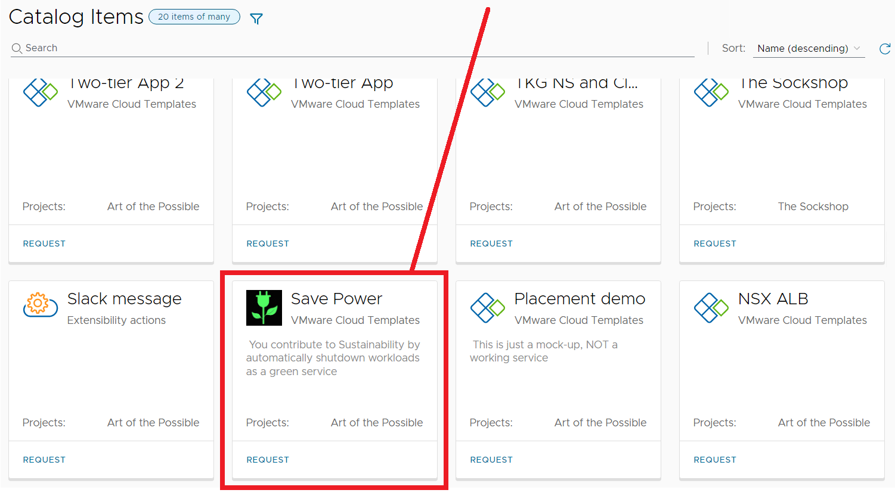

**The goal and purpose of this article is to discuss if Powering off VMs in our own infrastructure the same way Google GCP, AWS, and Azure VMs can do on a regular schedule**.** is practical, and show how to do this with VMware technology. If you missed the Hyperscaler discussion and how hyperscalers power off and power on VMs on a schedule, go ahead and read up on the article [Automated IaaS Powersaving, Green Sustainability - Pt.1](http://localhost:1313/post/2023-03-27/) 

# How to do it 

Since you are aware of costs of your IaaS, you are probably using more than one technology from VMware. In this article I have made a suggestion using  Orchestrator, Python, and a little bit of vRealize (Aria) Automation to accomplish a simple way to implement Power Off and Power On schedules for you Datacenter. 

## The technology behind

### The vRealize Automation Service Broker

To simplify the consumption of IT services for users by using a Self-Service Provisioning in a portal.  In this Multi-Cloud Management service catalog, we as an IT team have predefined our service offering. Here I have a Catalog Item called **Save Power**, that will deploy virtual machines and tag them with the tag *“powersave”*. 

When I click **Request** I am presented with a Request form with a possibility to change **Power Save** and **VM Size**. Both of these will affect our savings. 

By clicking the information icons on those two options, we can get more information about the different options. Here is an explanation for the **Power Save** mode. Note that We’ve chose to keep it simple with enforced power off at 18:00 and power on at 06:00, this could of course be customizable, but there are multiple reasons to keep it simple. 

The explanation for the Size explains the **Sizes** of the servers

Since our Automaton System (vRealize Automation) is connected to the Operations system (vRealize Operations) we can also Calculate the monthly price for the several options e.g. when we choose a large or a **small server**. 

### The vRealize Automation Cloud Template

Behind the Self Service choice there is a simple Cloud Template, in other words a declarative language, such as YAML  containing Infrastructure as Code (IaC) to define our  desired state of our cloud infrastructure. 

#### The tagging

### The vRealize Automation Extensibility

#### The vRealize Automation Slack Notification

### The vRealize Orchestrator workflow

### The vRealize Orchestrator Schedule

### The vRealize Operations uptimes proof

### The vRealize Operations Policy

