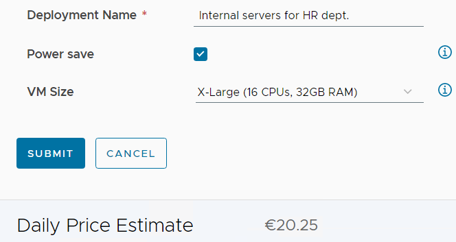

# **Up and running with powersaving**

**The goal and purpose of this article is to show an example of implementation to accomplish the scheduled Powering off(and on) of VMs in our own On-Premises datacenter the same way Google GCP, AWS, and Azure VMs does it with their Hyperscalers.**

- This article is divided into 3 parts:

  - [IaaS Automated Powersaving, Green Sustainability - Pt.1](https://bengt.no/post/2023-03-27/)
  - [IaaS Automated Powersaving, Green Sustainability - Pt.2](https://bengt.no/post/2023-04-16/)
  - [IaaS Automated Powersaving, Green Sustainability - Pt.3](https://bengt.no/post/2023-04-18/)


This is the **second** article containing the practical walk through of an example of how to do this with VMware technology. 

Note: If you missed the Hyperscaler discussion and how Hyperscalers actually power off and power on VMs on a schedule, and also **`“the WHY”`**, then please go ahead and read up on the article [IaaS Automated Powersaving, Green Sustainability - Pt.1](https://bengt.no/post/2023-03-27/)

.

.


# An example: how you can do it 
Since you are aware of costs of your Infrastructure, you are probably using more than one technology from VMware. 

In this article I have made a suggestion using  Orchestrator, Python, and Aria (Aria) Automation to accomplish a simple way to implement Power Off and Power On schedules for you Datacenter. 

### Requirements

To go through with this you need <u>Aria Automation</u>. Aria Automation contains Aria Orchestrator and Aria Service Broker that we show in this context.  *Aria Automation also contains SaltStack Config but we’re not using that this time.* 

A little Python knowledge is OK, but not necessary, because we are providing you with the scripts you need. 

# **Using the Self Service portal**

### Requesting a deployment with power save

To simplify the consumption of IT services for users by using a `Self-Service Provisioning` in a portal.  In this Multi-Cloud Management service catalog, we as an IT team have predefined our service offering. Here I have a Catalog Item called **Save Power**, that will deploy virtual machines and tag them with the tag *“powersave”*. 
#### Request
When we click **Request** I am presented with a `Request` form with a possibility to change **Power Save** and **VM Size**. 
Both of which will affect our savings: 


By clicking the **information icons** on those two options, we can get more information about the different options. 

> Note that We’ve chose to keep it simple with enforced power off at 18:00 and power on at 06:00, this could of course be customizable, but there are multiple reasons to keep it simple. 
>

#### Powersave mode 
Below is the explanation for the Size explains the impact of the **Power Save mode**


####  The deployment Size
Below is the explanation for the Size explains the **Sizes** of the servers we’re about to deploy:


#### Price

Since our Automaton System (Aria Automation) is has the ability to use pricecards or be connected to the Operations system (Aria Operations) with price cards we can also Calculate the monthly price for the several options   e.g. when we choose a **X-large** or a **small server**. 


 


## Slack Notification

The end result is that every morning and every evening there is a Power On and Off of the servers tagged with powersave = true. There is a slack notification each time: 


See further down for explanation about the Slack portion of the Python script that makes this happen. 

# **Behind the Scenes **

# Aria Automation Cloud Template

 The blueprint aka. Cloud template:  Behind the Self Service choice there is a simple Cloud Template, in other words a declarative language, such as YAML  containing Infrastructure as Code (IaC) to define our  desired state of our cloud infrastructure. 


> 
>
> You can find a **Github** IaC YAML code with a  [copy of the template here](https://github.com/VMwareAria/cloud-templates/blob/2debc41fe1b95e17a28c202eb05da0b31daa64d4/powersave/blueprint.yaml) 
>
> 

The tagging: The main thing about the Cloud template and the VM you are about to create is that is has a specific TAG. The Tag is created with this code snippet within the cloud template: 

      tags:
        - key: os
          value: windows
        - key: powersave
          value: ${input.powersave}


#### vSphere Tags:  in vSphere in the vCenter, this tagging is reflected


## The Orchestrator workflow and Schedule

To make sure machines marked (tagged) with the **`powersave = true`** tag will run as scheduled. We have created two Scheduled Workflows. One for 06:00:00 in the morning that will power on VMs, and One at 18:00:00 (6pm) that will power off VMs.  Both of these two scheduled workflows calls the workflow named “bgro-powersave-schedule”. 


Here is an example of the scheduled task


# **Python code / Orchestrator Workflow**


##### Get the code

> 
>
> GET YOUR copy of the code from [THIS GITHUB PAGE](https://github.com/VMwareAria/cloud-templates/blob/main/powersave/orchestrator-script.py)
>
> 

We just use a single Workflow called “bgro-powersave-schedule”. In that workflow, we have one scriptable task with a Python script that actually contains the most of the intelligence.  It finds all deployments with the power save tag  set to true then powers on or off accordingly.  


The Python script behind the scriptable task in the workflow **“bgro-powersave-schedule”** in Aria Orchestrator is made so it can manage the power on/off for VMs by powering them on or off based on a set time window. 

### Python

The Python script uses the Aria Automation (vRA) API to control the machines and also has a Slack web-hook to send notifications when machines are powered off or on.

#### Functions 

The script got these functions:

1. ``power_off_resources(resource_ids, inputs, bearer_token)`: Powers off resources given their IDs.
2. `power_on_resources(resource_ids, inputs, bearer_token)`: Powers on resources given their IDs.
3. `get_resource_ids_with_powersave_tag(bearer_token, inputs)`: Retrieves resource IDs with the "powersave" tag.
4. `vraauth(inputs)`: Authenticates with the vRA API *(returns a bearer token)*
5. `send_to_slack(message, inputs)`: Sends message to Slack.

The intelligence is of course the `power_off_resources` and `power_on_resources` functions will loop through the provided resource IDs and power them **off** or **on** using the vRA API. 


# Function to power on resources
```python
# Function to power on resources
def power_on_resources(resource_ids, inputs, bearer_token):
    # vRA API URL
    url = inputs["vra_url"]
    # vRA API headers with bearer token
    vraheaders = {
        "accept": "application/json",
        "content-type": "application/json",
        "Authorization": "Bearer " + bearer_token
    }
    # Loop through each resource ID and power it on
    with requests.Session() as session:
        for resource_id in resource_ids:
            # vRA API payload to power on the resource
            payload = {
                "actionId": "Cloud.vSphere.Machine.PowerOn",
                "inputs": {},
                "reason": "Power On"
            }
            # Send the power on request to vRA using the requests library
            resp = session.post(f"{url}/deployment/api/resources/{resource_id}/requests", headers=vraheaders, json=payload, verify=False)
            try:
                # Raise an error if the response status code is not 200 OK
                resp.raise_for_status()
                # Send a message to Slack to inform that the resource is being powered on
                send_to_slack(f"POWERSAVE: Power on successfully called for resource ID: {resource_id}", inputs)
            except requests.exceptions.HTTPError as err:
                # If the status code is 400, log the error and continue to the next resource
                if err.response.status_code == 400:
                    print(f"Power on failed for resource ID {resource_id}: {err}. Is it already powered on?", inputs)
                else:
                    # If the status code is not 400, raise the error
                    raise

```
# Function to power off resources

```python

# Function to power off resources
def power_off_resources(resource_ids, inputs, bearer_token):
    # vRA API URL
    url = inputs["vra_url"]
    # vRA API headers with bearer token
    vraheaders = {
        "accept": "application/json",
        "content-type": "application/json",
        "Authorization": "Bearer " + bearer_token
    }
    # Loop through each resource ID and power it off
    with requests.Session() as session:
        for resource_id in resource_ids:
            # vRA API payload to power off the resource
            payload = {
                "actionId": "Cloud.vSphere.Machine.Shutdown",
                "inputs": {},
                "reason": "Power Off"
            }
            # Send the power off request to vRA using the requests library
            resp = session.post(f"{url}/deployment/api/resources/{resource_id}/requests", headers=vraheaders, json=payload, verify=False)
            try:
                # Raise an error if the response status code is not 200 OK
                resp.raise_for_status()
                # Send a message to Slack to inform that the resource is being powered off
                send_to_slack(f"POWERSAVE: Power off successfully called for resource ID: {resource_id}", inputs)
            except requests.exceptions.HTTPError as err:
                # If the status code is 400, log the error and continue to the next resource
                if err.response.status_code == 400:
                    print(f"Power off failed for resource ID {resource_id}: {err}. Is it already powered off?", inputs)
                else:
                    # If the status code is not 400, raise the error
                    raise

```

# The send_to_slack function

```python
# Function to send a message to a Slack channel

def send_to_slack(message, inputs):

Slack webhook URL

webhook_url = inputs["slack_webhook_url"]

# Slack message payload
payload = {
    "text": message
}

# Send the message to Slack using the requests library
response = requests.post(
    webhook_url, data=json.dumps(payload),
    headers={'Content-Type': 'application/json'}
)

# Raise an error if the response status code is not 200 OK
if response.status_code != 200:
    raise ValueError(
        f'Request to Slack returned an error {response.status_code}, the response is:\n{response.text}'
    )
```


# Conclusion

If you download everything needed from the [Git Repository](https://github.com/VMwareAria/cloud-templates/tree/main/powersave), as mentioned [Above](#1-Get the code) , the rest of the code is fairly well documented within the code. Pay attention to what it does.


