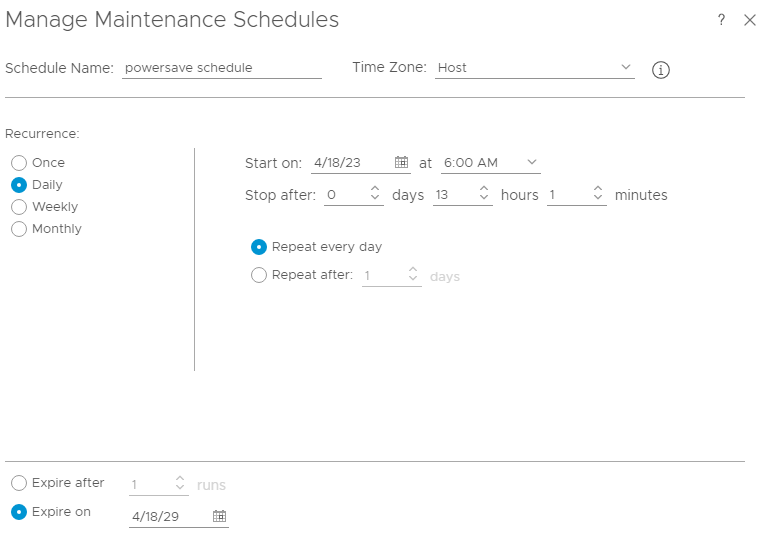
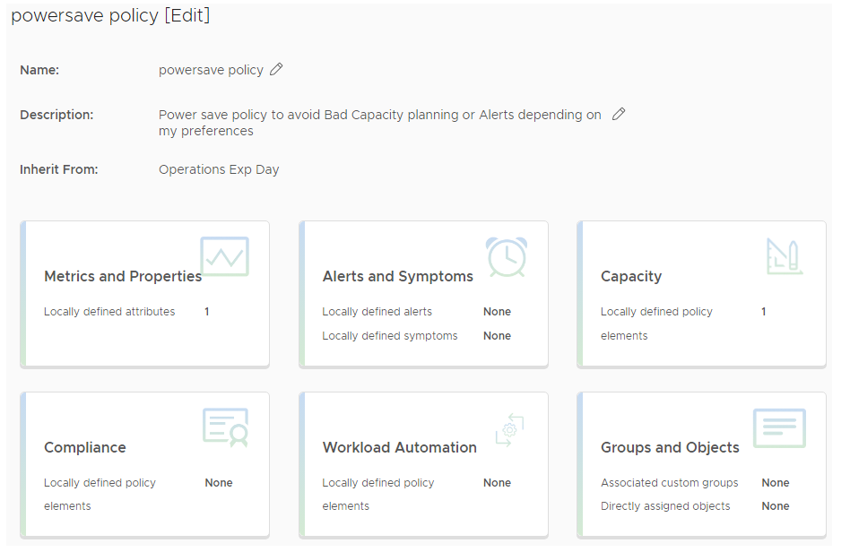
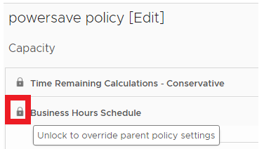
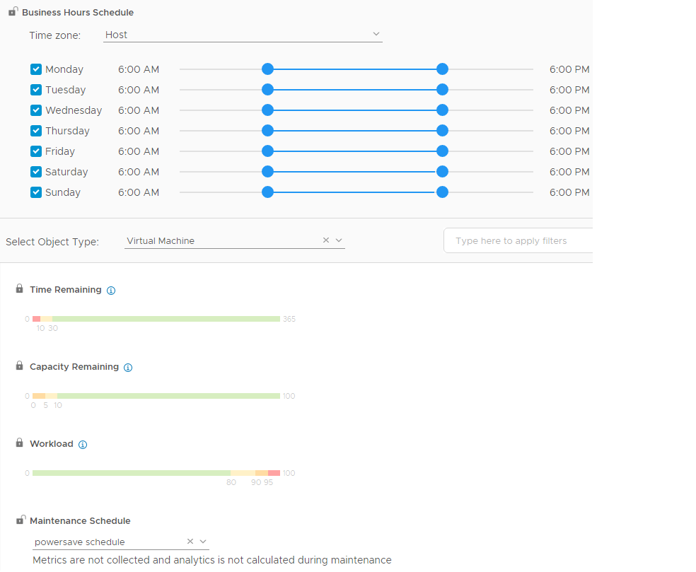
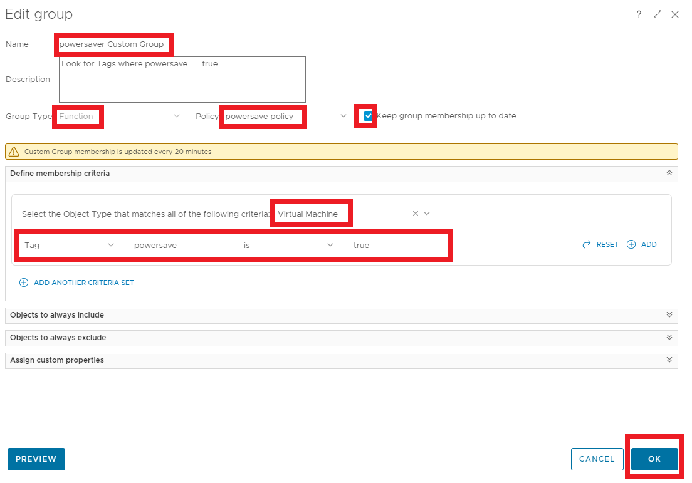

# **Get wise about Operations**

**When using Aria Operations we should ensure we are using corresponding working hours in the capacity policy, to avoid unforeseen effects on the calculation for powered off VMs**. The goal and purpose of this Topic is to show why we should either use the construct “Business Hours” or “Maintenance Schedules” in a VMware Aria Operations Policy to avoid hassle during the powering off of workloads

This article is divided into 3 parts:

- [IaaS Automated Powersaving, Green Sustainability - Pt.1](https://bengt.no/post/2023-03-27/)
- [IaaS Automated Powersaving, Green Sustainability - Pt.2](https://bengt.no/post/2023-04-16/)
- [IaaS Automated Powersaving, Green Sustainability - Pt.3](https://bengt.no/post/2023-04-18/)

# Maintenance schedules (offline objects)

Well, since we are turning workloads off and on again, pun intended, we need to make sure the operations tool we are using does not measure this as a ‘Object Down’. We need to make Aria Operations *Shut-Down Aware*, by making sure it does not measure uptime or alerts us when we are outside the business hours when the workload is controlled shut down.

Here are some facts about **Aria Operations Maintenance Schedule:**

- Metrics are not collected and analytics is not calculated

- Prevents vRealize Operations from showing misleading data based on those objects being offline 

- Does not generate anomalies or alerts, meaning any active symptoms and alerts are cancelled

- Does not generate incorrect anomalies and alerts that affect the data for setting dynamic thresholds for the object attributes

- Prevents misrepresentation of results with reports, views, and dashboards

Let’s see what the “Business Hours” does

# Policies with a Business Hours Schedule

Business hours schedule are based on policies, different objects can have different business hours. Maybe we like the thought of collecting metrics for the purpose of doing troubleshooting. 

- The capacity charts will be based on business hours, meaning it Affects calculation of capacity analysis and projections. 
- The capacity forecast for the object will be based on the *business hours* and not for the full 24 hours. 
- The reclamation and right-sizing analysis and recommendations are based on the business hours and ignore any spikes Outside the business hours.

- During *non*-business hours, Aria Operations analyze metrics for inventory, compliance, troubleshooting and other purposes. 

# Views and Advanced Time Settings

Views can have Business hours. You normally find this in Aria Operations using Lists, Summaries, Trends, or Distribution under the "Time Settings Tab". 

- Sets the time interval of data transformation
  The view is populated by data according to the time interval 
- Example: track average utilization of VMs over a week (business days), during specified hours of the day (business hours).

## Filter Tab on Views

It can also contain business hours or time constraints. This makes a View display less information, and using the *Business hours* functionality we activate Business Hours for a selected metric.

Now that we’ve discussed some of the options we have available for us, let us create a system for avoidance of nuances.

# **Creating a Maintenance Schedule**

In Aria Operations, Click Configure>**Maintenance Schedules**

Click **Add**

Fill in appropriate values according to the [documentation](https://docs.vmware.com/en/vRealize-Operations/8.10/com.vmware.vcom.core.doc/GUID-D1454A8F-6BB0-45EF-BB93-D41045C8AB30.html)

Set an expire in the future, repeat the task every day, stop the task after the maintenance window closes

Click **Save**

 

 

# Add a Policy

- In Aria Operations, Go to **Configure>Policies**
- Find and observe which policy is marked as **Active**, and with the letter “**D**” for Default policy
- Click **Add**
- Name your policy, for example “power save policy”
- Under the Inherit From, **select** the appropriate policy, usually the default policy from you ‘observation’ 
- Click **CREATE POLICY**

#### Business Hour schedule in the policy

Click on **Capacity**

Click the **LOCK icon** in front of Business Hour Schedule to unlock

On ‘Monday’, narrow down you time from 6:00 AM to 6:00 PM, The click **SET ALL**

#### Run maintenance mode in the policy

Select Object Type: **Virtual Machine**

Click **the Lock** in front of *Maintenance Schedule* to unlock it

Select the previous Maintenance Schedule we made: **powersave schedule**

Click **Save**

## Create a Custom Group

Sometimes we want a per/Business Unit or a per/department group, or in our case we would like to sort out workloads or data based on the tag powersave=true, and then use it as a foundation for displaying or sorting data in views and dashboards and also to add a policy to that group.

In Aria Operations, go to environment>custom groups and click **add**

Fill in Name and description

Group Type: **Function**

Select the previous created policy.  **Policy: powersave policy**

Mark **Keep group membership up to date**

Select the Object Type that matches all of the following criteria: **Virtual Machine**

Tag, **powersave**, is, **true**

# Conclusion

We have now selected VMs in vSphere with the Tags powersave=true and added them dynamically into a group that has a policy containing scheduled maintenance window. 

